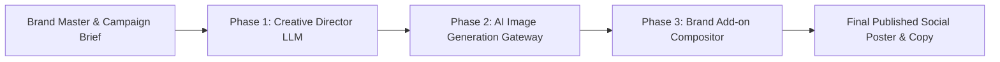
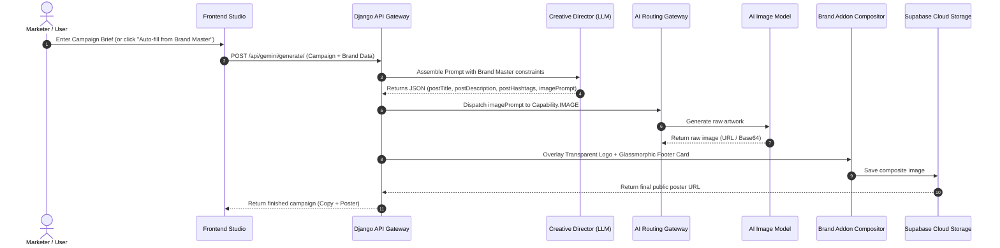
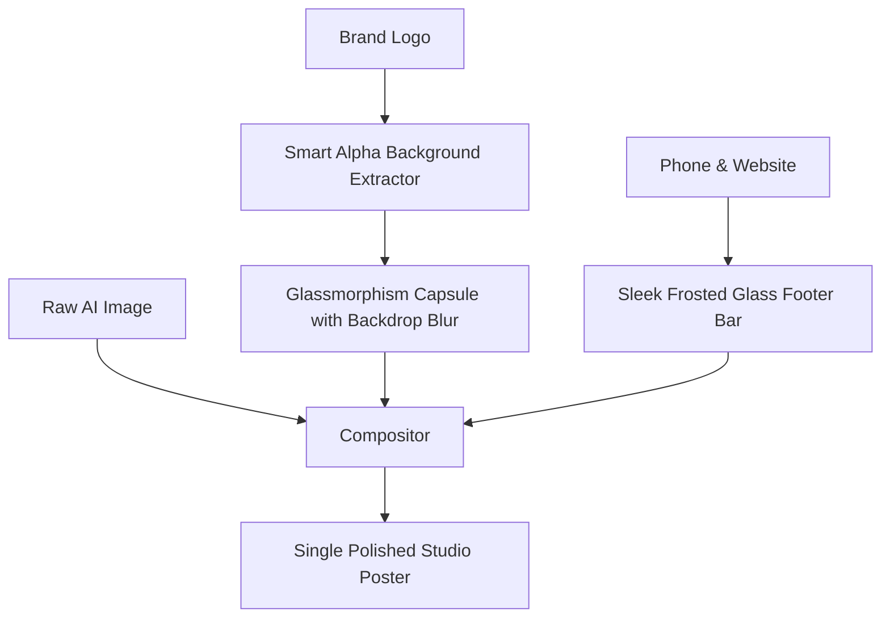

# Scaleezy — Brand Master to AI Poster Generation Pipeline
**Technical & Architectural Workflow Guide**

---

## 1. Executive Summary

Scaleezy transforms Brand Master identity attributes (colors, typography, tone, positioning, logo, and contact info) into on-brand marketing campaigns and social media posters through a **three-stage hybrid AI pipeline**:



1. **Phase 1 (Creative Direction)**: A reasoning LLM combines the Brand Master parameters and the user's campaign goals into social copy + a tailored, photographic prompt for the image model.
2. **Phase 2 (AI Image Synthesis)**: The `AIRouter` gateway dispatches the visual prompt to the configured image model (e.g. Google Gemini, OpenRouter `recraft-v3`, FLUX, etc.).
3. **Phase 3 (Post-Production Compositing)**: A deterministic graphic compositor overlays the transparent brand logo capsule and verified contact footer onto the generated artwork.

---

## 2. End-to-End Pipeline Breakdown



---

## 3. Step-by-Step Technical Details

### Step 1: Ingesting Brand Master Parameters
When a campaign is initiated, Scaleezy extracts the verified brand identity from the database:
- **Brand Name & Positioning Tagline**: Sets the context and identity for the content.
- **Brand Voice & Tone**: (e.g., *Luxury & Authoritative*, *Vibrant & Playful*, *Minimalist & Modern*).
- **Color Palette**: Primary, Light, and Accent hex codes (e.g. `#1A1A1A`, `#7C3AED`).
- **Typography Direction**: Primary header and secondary body font pairings.
- **Brand Assets**: High-resolution Logo URL, contact phone number, and official website.
- **Brand Rules & Compliance**: Mandatory disclaimers, negative keywords, and compliance rules.

---

### Step 2: The Creative Director LLM (Prompt Engineering Phase)
Scaleezy does **not** directly pass raw user inputs into the image generator. Instead, a reasoning model acts as an award-winning Creative Director:

1. **Color Harmony Integration**: Injects the brand's primary and accent palette into the visual lighting and environment descriptions.
2. **Negative Space Allocation**:
   - Explicitly instructs the AI image model to leave the **top-right area clean** for post-production logo placement.
   - Instructs the AI image model to leave the **bottom 15% clean** for the contact footer.
3. **Negative Constraints (Zero Hallucination)**:
   - Forbids the image model from drawing fake watermarks, artificial phone numbers, or illegible text into raw pixels.
4. **Offer & CTA Handling**:
   - If an offer/CTA is provided, it dictates the headline text.
   - If the user leaves the offer empty, the prompt strictly commands the model: *"Do NOT render, invent, or draw any CTA text, discount badges, or buttons."*

**Creative Director Output (JSON):**
```json
{
  "postTitle": "Unlock Seamless Global Mobility with Visaworx",
  "postDescription": "Experience stress-free visa consultations with our verified experts. ✈️🌍 #Visaworx #Travel",
  "postHashtags": "#Visaworx #VisaConsultants #GlobalTravel #StudyAbroad",
  "imagePrompt": "A breathtaking cinematic photograph of a luxury passport and golden boarding pass resting on a sleek marble desk next to a modern architectural window overlooking a sunlit metropolitan airport. Lighting is soft golden hour with subtle violet rim lighting (#7C3AED). Crisp, high-end editorial aesthetic. Clean top-right and bottom margins."
}
```

---

### Step 3: AI Gateway Routing & Redundancy
The generated `imagePrompt` is passed to the **AIRouter**:
- **Strategy Support**: Supports **Failover** (try primary, fallback on error), **Round Robin** (load distribution), or **Best Of** (generate candidates and select highest quality).
- **Multi-Provider & Multi-Model**: Dispatches to configured providers:
  - **Google Gemini** (`gemini-3.1-flash`, `gemini-1.5-pro`)
  - **OpenRouter** (`recraft/recraft-v3:free`, `black-forest-labs/flux-1.1-pro`)
  - **Together AI / Custom Endpoints**
- Provider credentials remain strictly encrypted server-side and are never sent to the browser.

---

### Step 4: Brand Addon Compositor (Graphic Engine)
Once the raw image is generated, Scaleezy runs the `BrandAddonCompositor` using Python Imaging Library (PIL):



1. **Smart Alpha Background Extraction**:
   - Automatically detects and removes solid white bounding boxes from uploaded logos, making them transparent.
2. **Glassmorphic Logo Capsule (Top-Right)**:
   - Renders a frosted glass capsule with backdrop blur and subtle border highlight, ensuring the logo looks native on any dark, light, or textured background.
3. **Single Sleek Footer Bar (Bottom)**:
   - Renders a translucent card containing verified phone number, website, and brand accent indicators.
   - Eliminates overlapping text and maintains consistent typography across all campaigns.

---

### Step 5: Persistence & Delivery
1. The composited image is uploaded to **Supabase Object Storage**.
2. A new `ContentItem` draft is saved in the database with complete audit lineage (model used, latency, prompt, generated copy).
3. The real-time response is delivered to the Frontend Studio ready for review, download, or multi-platform social scheduling.

---

## 4. Key Advantages for the Team

| Feature | How It Works | Benefit |
| :--- | :--- | :--- |
| **Strict Brand Consistency** | Palette, tone, and fonts are enforced across all prompts | Every campaign strictly adheres to brand identity guidelines. |
| **No Artificial Overlaps** | Negative prompt constraints keep edges clean for post-compositing | Prevents double footers or scrambled AI-generated text. |
| **Provider Independence** | Switch between Gemini, OpenRouter, and custom models in one click | Zero vendor lock-in; switch models if prices or limits change. |
| **Complete Security** | API keys are encrypted with AES at rest and executed server-side | Zero credentials or tokens are exposed to client browsers. |
