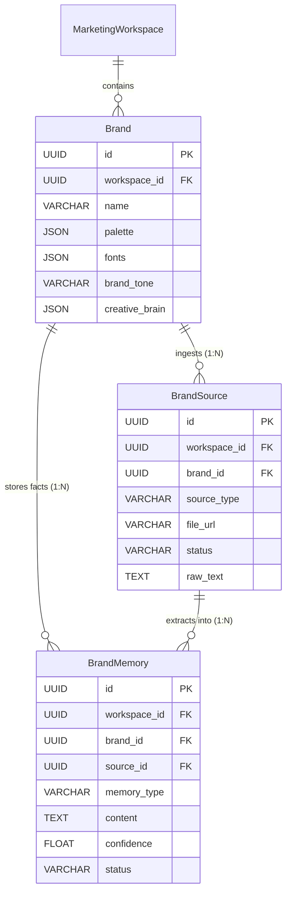
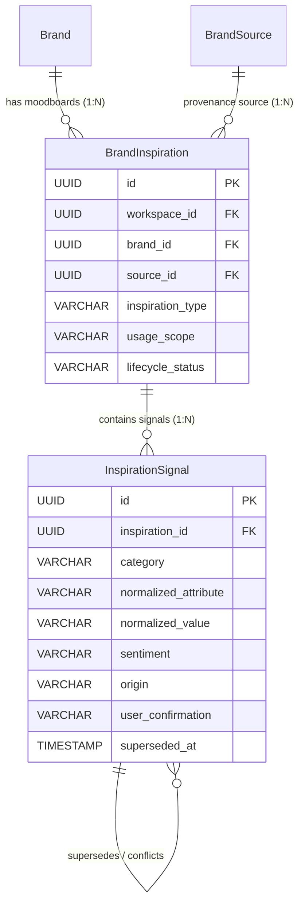
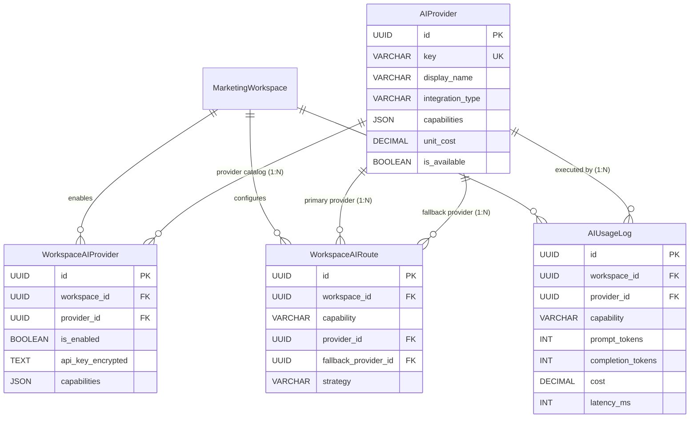
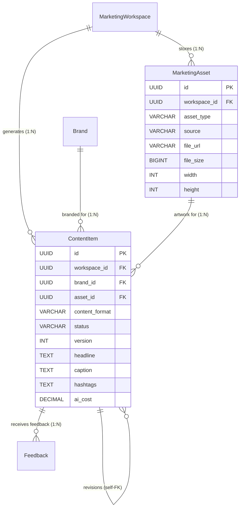
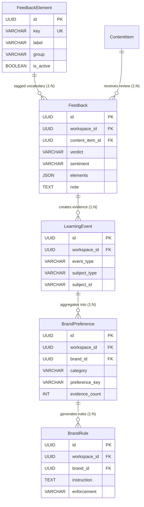
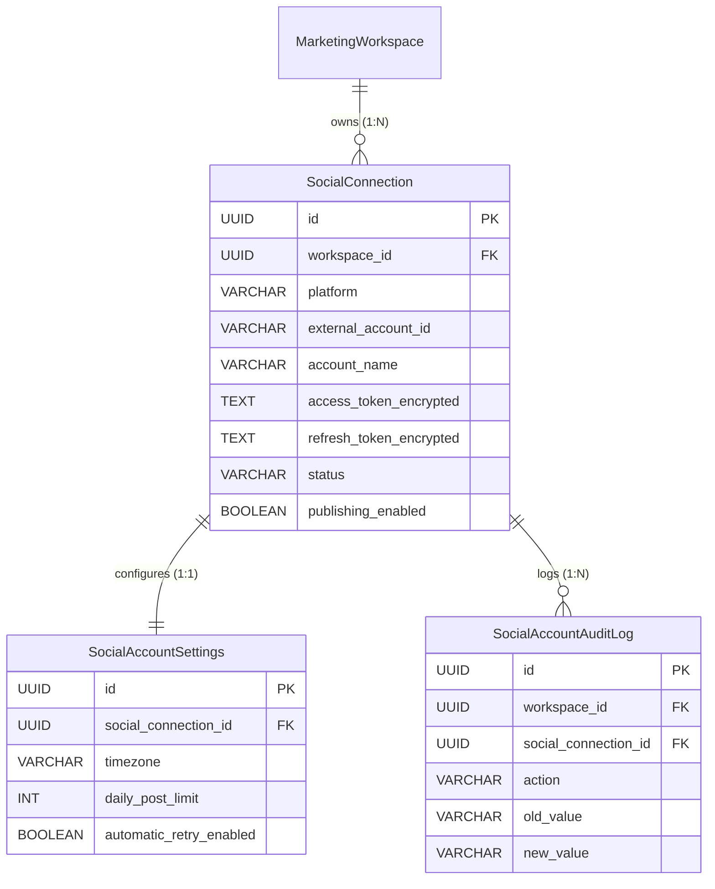
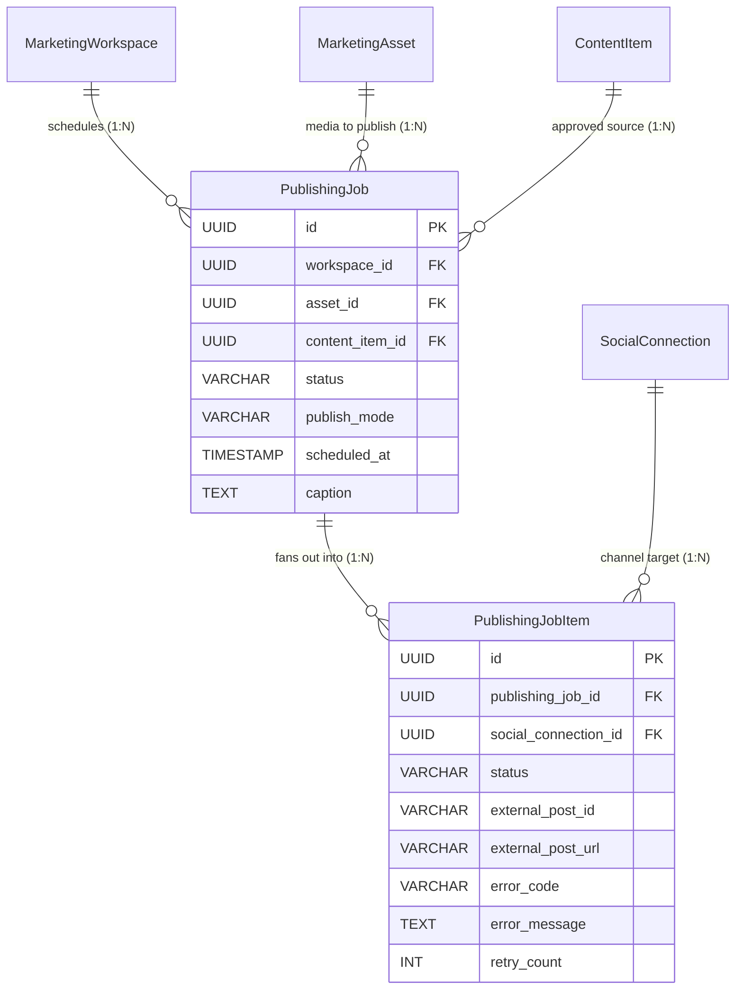
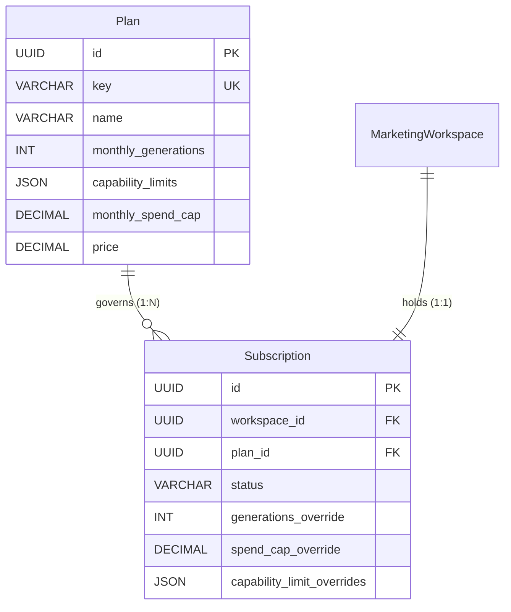

# Scaleezy Marketing Hub — Database Schema, Table Details & Entity-Relationship (ER) Guide

This document provides an exhaustive, field-by-field reference of every database table across the Scaleezy platform, the specific details each table stores, its primary/foreign key connections, lifecycle constraints, and visual subsystem ER diagrams.

---

## 1. Master System Entity-Relationship (ER) Diagram

```mermaid
erDiagram
    %% Core Tenancy & Users
    User ||--o{ WorkspaceMember : "has memberships"
    MarketingWorkspace ||--o{ WorkspaceMember : "has members"
    MarketingWorkspace ||--o{ Brand : "owns"
    MarketingWorkspace ||--|| Subscription : "has entitlement"
    MarketingWorkspace ||--o{ SocialConnection : "owns channels"
    MarketingWorkspace ||--o{ MarketingAsset : "owns assets"
    MarketingWorkspace ||--o{ ContentItem : "owns content"
    MarketingWorkspace ||--o{ PublishingJob : "schedules jobs"
    MarketingWorkspace ||--o{ DailyMetric : "has analytics"
    MarketingWorkspace ||--o{ PlatformPerformance : "has metrics"
    MarketingWorkspace ||--o{ CampaignROI : "has roi"
    MarketingWorkspace ||--o{ WorkspaceAIProvider : "enables"
    MarketingWorkspace ||--o{ WorkspaceAIRoute : "configures routes"
    MarketingWorkspace ||--o{ AIUsageLog : "incurs usage"

    %% Brand Brain & Knowledge
    Brand ||--o{ BrandSource : "has knowledge sources"
    Brand ||--o{ BrandMemory : "has extracted facts"
    Brand ||--o{ BrandInspiration : "has inspirations"
    Brand ||--o{ ContentItem : "creates content for"
    Brand ||--o{ Feedback : "learns from"
    Brand ||--o{ BrandPreference : "has preferences"
    Brand ||--o{ BrandRule : "obeys rules"
    BrandSource ||--o{ BrandMemory : "extracts"
    BrandSource ||--o{ BrandInspiration : "provenance source for"
    BrandInspiration ||--o{ InspirationSignal : "extracts signals"

    %% Content, Creative & Layouts
    MarketingAsset ||--o{ ContentItem : "visual asset for"
    MarketingAsset ||--o{ PublishingJob : "asset to publish"
    ContentItem ||--o{ ContentItem : "revisions / parent"
    ContentItem ||--o{ Feedback : "reviewed by"
    ContentItem ||--o{ PublishingJob : "published by"

    %% Feedback & Closed-Loop Learning
    Feedback ||--o{ FeedbackElement : "tagged with vocabulary"
    Feedback ||--o{ LearningEvent : "generates evidence"
    LearningEvent ||--o{ BrandPreference : "accumulates into"
    BrandPreference ||--o{ BrandRule : "backs"

    %% AI Router & Providers
    AIProvider ||--o{ WorkspaceAIProvider : "enabled via"
    AIProvider ||--o{ WorkspaceAIRoute : "serves capability"
    AIProvider ||--o{ AIUsageLog : "logged in"
    Subscription }o--|| Plan : "governed by"

    %% Social Accounts & Publishing
    SocialConnection ||--|| SocialAccountSettings : "configures (1:1)"
    SocialConnection ||--o{ SocialAccountAuditLog : "audits"
    SocialConnection ||--o{ PublishingJobItem : "target channel"
    PublishingJob ||--o{ PublishingJobItem : "fans out into"
```

---

## 2. Table-by-Table Technical Reference

### Subsystem 1: Tenancy, Workspaces & RBAC (`apps.workspaces` & `apps.users`)

#### 1.1 Table: `marketing_workspaces`
- **Model**: `MarketingWorkspace` (`apps.workspaces.models`)
- **Purpose**: The primary tenant boundary across the entire application. Every business table hangs off this workspace.
- **Details Stored**: Workspace name, auto-generated unique speakable client code (e.g. `SCZ-K4M2R9TB`), timezone, default language, tenant kind (Client vs Internal test), lifecycle status (`ACTIVE`, `SUSPENDED`, `ARCHIVED`), and Scaleezy operator approval status (`PENDING`, `APPROVED`, `REJECTED`).

| Column | Data Type | Constraints / Details | Description |
|---|---|---|---|
| `id` | UUID | Primary Key, default `uuid.uuid4` | Unique workspace identifier. |
| `customer_id` | VARCHAR(255) | Indexed, Not Null | Soft reference to customer in core Scaleezy system. |
| `client_code` | VARCHAR(32) | UNIQUE, Indexed, Speakable | 8-character human-friendly code (e.g. `SCZ-K4M2R9TB`). |
| `workspace_name` | VARCHAR(255) | Not Null | Display name of the workspace/agency client. |
| `timezone` | VARCHAR(50) | Default: `'UTC'` | Default operational timezone for publishing & analytics. |
| `default_language` | VARCHAR(10) | Default: `'en'` | Primary language code. |
| `kind` | VARCHAR(16) | Choices: `CLIENT`, `INTERNAL` | `INTERNAL` workspaces are excluded from platform-wide learning. |
| `status` | VARCHAR(20) | Choices: `ACTIVE`, `SUSPENDED`, `ARCHIVED` | Lifecycle flag. `SUSPENDED` blocks writes; `ARCHIVED` stops billing. |
| `status_reason` | VARCHAR(255) | Blankable | Reason for suspension or archival. |
| `status_changed_at`| TIMESTAMP | Nullable | When status last transitioned. |
| `approval_status` | VARCHAR(20) | Choices: `PENDING`, `APPROVED`, `REJECTED` | Platform operator gate. Defaults to `PENDING` on signup. |
| `created_at` / `updated_at` | TIMESTAMP | Auto timestamps | Audit timestamps. |

- **Foreign Key Connections**:
  - `members` (1:N) → `workspace_members.workspace_id` (`CASCADE`)
  - `brands` (1:N) → `brands.workspace_id` (`CASCADE`)
  - `subscription` (1:1) → `billing_subscriptions.workspace_id` (`CASCADE`)
  - `social_connections` (1:N) → `social_connections.workspace_id` (`CASCADE`)
  - `marketing_assets` (1:N) → `marketing_assets.workspace_id` (`CASCADE`)
  - `content_items` (1:N) → `content_items.workspace_id` (`CASCADE`)
  - `publishing_jobs` (1:N) → `publishing_jobs.workspace_id` (`CASCADE`)
  - `ai_usage_logs` (1:N) → `ai_usage_logs.workspace_id` (`CASCADE`)

---

#### 1.2 Table: `workspace_members`
- **Model**: `WorkspaceMember` (`apps.workspaces.models`)
- **Purpose**: Joins Django auth users to workspaces with strict Role-Based Access Control (RBAC).
- **Details Stored**: User role rank (`OWNER` > `ADMIN` > `MANAGER` > `EDITOR` > `VIEWER`), membership status (`ACTIVE`, `SUSPENDED`), inviter reference, and last active timestamp.

| Column | Data Type | Constraints / Details | Description |
|---|---|---|---|
| `id` | UUID | Primary Key | Membership join record ID. |
| `workspace_id` | UUID | FK → `marketing_workspaces.id` (`CASCADE`) | Target workspace. |
| `user_id` | INTEGER/UUID | FK → `auth_user.id` (`CASCADE`) | Django user account. |
| `role` | VARCHAR(20) | Choices: `OWNER`(50), `ADMIN`(40), `MANAGER`(30), `EDITOR`(20), `VIEWER`(10) | Hierarchical role ranking for RBAC checks. |
| `status` | VARCHAR(20) | Choices: `ACTIVE`, `SUSPENDED` | Member access status. |
| `invited_by_id` | INTEGER/UUID | FK → `auth_user.id` (`SET_NULL`, Nullable) | Who invited this team member. |
| `last_active_at` | TIMESTAMP | Nullable | Last API request timestamp. |

- **Integrity Constraints**:
  - `UNIQUE (workspace_id, user_id)`: A user can only have one membership record per workspace.

---

### Subsystem 2: Brand Brain & Knowledge Base (`apps.brands` & `apps.knowledge`)

#### 2.1 Table: `brands`
- **Model**: `Brand` (`apps.brands.models`)
- **Purpose**: Stores the core visual identity, design tokens, voice, and compiled "Brand Brain" intelligence for a business.
- **Details Stored**: Color palette (`primary`, `light`, `accent`), font pairings, layout preference, tagline, tone of voice, logo storage URL/path, competitor JSON, products/services JSON, and compiled taste rules (`creative_brain`).

| Column | Data Type | Constraints / Details | Description |
|---|---|---|---|
| `id` | UUID | Primary Key | Unique Brand identifier. |
| `workspace_id` | UUID | FK → `marketing_workspaces.id` (`CASCADE`) | Owning workspace. |
| `name` | VARCHAR(255) | Not Null | Brand name. |
| `industry` | VARCHAR(100) | Blankable | Business sector/domain. |
| `website` | VARCHAR(500) | URL field | Official brand website. |
| `description` | TEXT | Blankable | First-party statement of what the brand is. |
| `audience` | TEXT | Blankable | Target buyer persona and demographic. |
| `palette` | JSON | Default: `{"primary": "#221F3C", "light": "#FDFFE9", "accent": "#D2FFAA"}` | Brand color tokens used by poster composer. |
| `fonts` | JSON | Default: `{"primary": "DM Sans", "secondary": "Noto Serif"}` | Typography configuration. |
| `layout_preference`| VARCHAR(64) | Choices: `agency_column`, `jil_sander`, `cos_split`, `data_hero`, `ghost_word`, `vs_table` | Preferred poster layout template. |
| `tagline` | VARCHAR(255) | Blankable | Brand slogan / punchline. |
| `brand_tone` | VARCHAR(255) | Blankable | Voice guidelines (e.g. "Authoritative, punchy, modern"). |
| `logo_url` | VARCHAR(1000) | URL field | Public logo image URL in Supabase Storage. |
| `logo_storage_path`| VARCHAR(1000)| Blankable | Bucket storage path. |
| `creative_brain` | JSON | Default `{}` | Compiled learned rules and fine-tuned prompt instructions. |
| `brain_compiled_at`| TIMESTAMP | Nullable | Timestamp of last successful brain compilation. |

---

#### 2.2 Table: `knowledge_brandsource`
- **Model**: `BrandSource` (`apps.knowledge.models`)
- **Purpose**: Raw uploaded or linked material provided by a brand (PDFs, guidelines, URLs, transcripts).
- **Details Stored**: Source type (14 categories: `PDF`, `WEBSITE`, `TRANSCRIPT`, `NOTE`, etc.), raw extracted text, file URLs, content hash for deduplication, processing status (`UPLOADED`, `QUEUED`, `PROCESSING`, `READY`, `FAILED`, `ARCHIVED`).

| Column | Data Type | Constraints / Details | Description |
|---|---|---|---|
| `id` | UUID | Primary Key | Unique Source ID. |
| `workspace_id` | UUID | FK → `marketing_workspaces.id` (`CASCADE`) | Tenant boundary. |
| `brand_id` | UUID | FK → `brands.id` (`CASCADE`) | Associated brand. |
| `source_type` | VARCHAR(20) | Choices: `WEBSITE`, `URL`, `PDF`, `DOCUMENT`, `TRANSCRIPT`, `NOTE`, `AUDIO`, `VIDEO`, etc. | Classification of uploaded source. |
| `title` | VARCHAR(255) | Not Null | Human-readable document name. |
| `source_url` | VARCHAR(1000) | URL, Nullable | External website/source URL. |
| `file_url` / `storage_path`| VARCHAR(1000)| Nullable | Supabase storage location for binary files. |
| `status` | VARCHAR(20) | Choices: `UPLOADED`, `QUEUED`, `PROCESSING`, `READY`, `NEEDS_REVIEW`, `FAILED`, `ARCHIVED` | Extraction pipeline lifecycle. |
| `raw_text` | TEXT | Nullable | Extracted plaintext contents. |
| `content_hash` | VARCHAR(255) | Indexed, Nullable | SHA-256 hash preventing duplicate file uploads. |
| `created_by_id` | INTEGER/UUID | FK → `auth_user.id` (`SET_NULL`, Nullable) | Uploading user. |

---

#### 2.3 Table: `knowledge_brandmemory`
- **Model**: `BrandMemory` (`apps.knowledge.models`)
- **Purpose**: Structured facts and atomic truths extracted from brand sources.
- **Details Stored**: Fact categorization (`BRAND_CANON`, `PRODUCT_TRUTH`, `BUYER_PAIN`, `POSITIONING_SIGNAL`, etc.), memory scope (`BRAND`, `CAMPAIGN`, `ASSET`), confidence score (0.0 to 1.0), and lifecycle verification status (`CANDIDATE`, `CONFIRMED`, `REJECTED`, `SUPERSEDED`).

| Column | Data Type | Constraints / Details | Description |
|---|---|---|---|
| `id` | UUID | Primary Key | Unique Memory ID. |
| `workspace_id` | UUID | FK → `marketing_workspaces.id` (`CASCADE`) | Tenant boundary. |
| `brand_id` | UUID | FK → `brands.id` (`CASCADE`) | Owning brand. |
| `source_id` | UUID | FK → `knowledge_brandsource.id` (`SET_NULL`, Nullable) | Provenance link to raw document. |
| `memory_type` | VARCHAR(30) | Choices: `BRAND_CANON`, `PRODUCT_TRUTH`, `BUYER_PAIN`, `OBJECTION`, `FOUNDER_POV`, etc. | Fact classification. |
| `content` | TEXT | Not Null | The exact atomic factual statement. |
| `confidence` | FLOAT | Default: `1.0` | Extraction confidence. |
| `scope` | VARCHAR(20) | Choices: `BRAND`, `CAMPAIGN`, `ASSET`, `TENANT` | Reach of this memory. |
| `permanence` | VARCHAR(20) | Choices: `TEMPORARY`, `EMERGING`, `PERMANENT` | Memory durability. |
| `status` | VARCHAR(20) | Choices: `CANDIDATE`, `CONFIRMED`, `REJECTED`, `SUPERSEDED`, `EXPIRED` | Human/AI verification state. |
| `supersedes_id` | UUID | Self-FK → `knowledge_brandmemory.id` (`SET_NULL`, Nullable) | Points to retired previous memory version. |

---

### Subsystem 3: Inspirations & Preference Authority Engine (`apps.inspirations`)

#### 3.1 Table: `inspirations_brandinspiration`
- **Model**: `BrandInspiration` (`apps.inspirations.models`)
- **Purpose**: Visual references, competitor advertisements, moodboards, and posts that define what the brand's creative should *feel* like.
- **Details Stored**: Inspiration type (`IMAGE`, `REEL`, `AD`, `POST`, `MOODBOARD`, etc.), user annotation notes, reference media URL/storage path, focus areas JSON, and lifecycle status (`ACTIVE`, `ARCHIVED`).

| Column | Data Type | Constraints / Details | Description |
|---|---|---|---|
| `id` | UUID | Primary Key | Unique Inspiration reference ID. |
| `workspace_id` | UUID | FK → `marketing_workspaces.id` (`CASCADE`) | Tenant boundary. |
| `brand_id` | UUID | FK → `brands.id` (`CASCADE`) | Owning brand. |
| `source_id` | UUID | FK → `knowledge_brandsource.id` (`SET_NULL`, Nullable) | Provenance link if uploaded via Knowledge. |
| `inspiration_type` | VARCHAR(30) | Choices: `IMAGE`, `SCREENSHOT`, `URL`, `POST`, `REEL`, `VIDEO`, `AD`, `MOODBOARD`, etc. | Media classification. |
| `title` | VARCHAR(255) | Not Null | Descriptive title. |
| `annotation` | TEXT | Blankable | The user's explicit instructions in their own words. |
| `file_url` / `reference_url` | VARCHAR(1000) | Nullable | Media link. |
| `usage_scope` | VARCHAR(30) | Choices: `FULL_REFERENCE`, `SPECIFIC_ELEMENTS` | Whether to draw full style or selective elements. |
| `focus_areas` | JSON | Default `[]` | List of `SignalCategory` values (e.g. `["TYPOGRAPHY", "COLOR"]`). |
| `lifecycle_status` | VARCHAR(20) | Choices: `ACTIVE`, `ARCHIVED` | Retrieval flag (`eligible_for_retrieval()`). |

---

#### 3.2 Table: `inspirations_inspirationsignal`
- **Model**: `InspirationSignal` (`apps.inspirations.models`)
- **Purpose**: Atomic design preference signals extracted from inspirations. Enforces the **Preference Authority Engine**.
- **Details Stored**: Category (17 choices: `TYPOGRAPHY`, `COLOR`, `LAYOUT`, `COMPOSITION`, `MOOD`, etc.), folded lowercase attribute key & value (`normalized_attribute`, `normalized_value`), sentiment (`LIKED`, `DISLIKED`, `NEUTRAL`), origin (`USER` human-stated vs `AI` inferred), confirmation state (`CONFIRMED`, `PENDING`, `REJECTED`), and append-only supersession metadata.

| Column | Data Type | Constraints / Details | Description |
|---|---|---|---|
| `id` | UUID | Primary Key | Unique signal ID. |
| `inspiration_id` | UUID | FK → `inspirations_brandinspiration.id` (`CASCADE`) | Derived tenant parent (holds NO redundant workspace column). |
| `category` | VARCHAR(30) | Choices: `SignalCategory` (17 options) | Design attribute domain. |
| `attribute` / `normalized_attribute` | VARCHAR(120) | Folded text index | Attribute name (e.g. "headline typography"). |
| `value` / `normalized_value` | VARCHAR(255) | Folded text index | Attribute value (e.g. "condensed sans-serif bold"). |
| `sentiment` | VARCHAR(20) | Choices: `LIKED`, `DISLIKED`, `NEUTRAL` | Human/AI stance on this attribute. |
| `weight` / `confidence` | FLOAT | Range: `0.0` to `1.0` | Relative strength & AI inference confidence. |
| `origin` | VARCHAR(10) | Choices: `USER`, `AI` (Immutable) | Provenance of who created the signal. |
| `user_confirmation` | VARCHAR(20) | Choices: `CONFIRMED`, `PENDING`, `REJECTED` | Human gate on AI inferences. |
| `conflicts_with_id` | UUID | Self-FK (`SET_NULL`, Nullable) | Points to contradicting signal. |
| `superseded_by_id` | UUID | Self-FK (`SET_NULL`, Nullable) | Points to newer signal version. |
| `superseded_at` | TIMESTAMP | Nullable | When preference was retired (determines active truth). |
| `superseded_reason` | VARCHAR(50) | Choices: `SUPERSEDED_BY_NEWER_USER_SIGNAL`, `SUPERSEDED_BY_CONFIRMED_AI_DIRECTION`, etc. | Audit rationale. |

- **Integrity Constraints**:
  - `UNIQUE (inspiration, category, normalized_attribute) WHERE origin='USER' AND superseded_at IS NULL AND user_confirmation='CONFIRMED'`: Guarantees exactly **one active human truth per attribute**.
  - `CHECK NOT (superseded_by_id = id)`: Prevents circular supersession.

---

### Subsystem 4: AI Routing, Providers & Usage Metering (`apps.ai` & `apps.gemini`)

#### 4.1 Table: `ai_providers`
- **Model**: `AIProvider` (`apps.ai.models`)
- **Purpose**: Global catalog of installed AI provider adapters and tenant-owned custom endpoints.
- **Details Stored**: Unique key (e.g. `gemini`, `openai`, `custom-llm`), integration type (`INSTALLED`, `OPENAI_COMPATIBLE`, `SCALEEZY_JSON`), supported capability array, base URL, default model name, unit cost, and operator kill switch (`is_available`).

| Column | Data Type | Constraints / Details | Description |
|---|---|---|---|
| `id` | UUID | Primary Key | Unique Provider Catalog ID. |
| `owner_workspace_id` | UUID | FK → `marketing_workspaces.id` (`CASCADE`, Nullable) | Null for platform providers; set for custom tenant endpoints. |
| `key` | VARCHAR(50) | UNIQUE, Slug | Adapter lookup key (`gemini`, `openai`). |
| `display_name` | VARCHAR(100) | Not Null | UI label. |
| `integration_type` | VARCHAR(32) | Choices: `INSTALLED`, `OPENAI_COMPATIBLE`, `SCALEEZY_JSON` | Protocol adapter class. |
| `base_url` | VARCHAR(500) | Blankable | Endpoint URL for custom LLMs. |
| `capabilities` | JSON | Default `[]` | List of `Capability` enum values this model can execute. |
| `default_model` | VARCHAR(100) | Blankable | Default model string (e.g. `gemini-1.5-flash`). |
| `is_available` | BOOLEAN | Default `True` | Global kill switch. |
| `unit_cost` | DECIMAL(10,4) | Default `0.0000` | Estimated cost per call for `BEST_OF` scoring. |

---

#### 4.2 Table: `workspace_ai_providers`
- **Model**: `WorkspaceAIProvider` (`apps.ai.models`)
- **Purpose**: Per-workspace AI provider enablement, assigned capabilities, and encrypted API credentials.
- **Details Stored**: Enabled status, Fernet-encrypted API key (`api_key_encrypted`), model override, and active capability subset.

| Column | Data Type | Constraints / Details | Description |
|---|---|---|---|
| `id` | UUID | Primary Key | Join ID. |
| `workspace_id` | UUID | FK → `marketing_workspaces.id` (`CASCADE`) | Target tenant. |
| `provider_id` | UUID | FK → `ai_providers.id` (`CASCADE`) | Enabled provider. |
| `is_enabled` | BOOLEAN | Default `True` | Workspace on/off toggle. |
| `api_key_encrypted`| TEXT | Blankable, Fernet Encrypted | Customer-supplied API key, encrypted at rest. |
| `custom_model` | VARCHAR(100) | Blankable | Workspace model override. |
| `capabilities` | JSON | Default `[]` | Editable assignment of capabilities for this provider. |

- **Integrity Constraints**:
  - `UNIQUE (workspace_id, provider_id)`: A workspace configures each provider once.

---

#### 4.3 Table: `workspace_ai_routes`
- **Model**: `WorkspaceAIRoute` (`apps.ai.models`)
- **Purpose**: Defines which AI provider handles each specific capability for a workspace.
- **Details Stored**: Capability (`TEXT`, `IMAGE`, `IMAGE_ANALYSIS`, `IMAGE_CAPTION`, `VIDEO`, `EMBEDDING`), primary provider FK, fallback provider FK, and dispatch strategy (`FAILOVER`, `BEST_OF`, `ROUND_ROBIN`).

| Column | Data Type | Constraints / Details | Description |
|---|---|---|---|
| `id` | UUID | Primary Key | Route ID. |
| `workspace_id` | UUID | FK → `marketing_workspaces.id` (`CASCADE`) | Target tenant. |
| `capability` | VARCHAR(32) | Choices: `TEXT`, `IMAGE`, `IMAGE_ANALYSIS`, `IMAGE_CAPTION`, `VIDEO`, `EMBEDDING` | Routed task. |
| `provider_id` | UUID | FK → `ai_providers.id` (`CASCADE`) | Primary executing provider. |
| `fallback_provider_id`| UUID | FK → `ai_providers.id` (`SET_NULL`, Nullable) | Secondary provider if primary fails. |
| `strategy` | VARCHAR(20) | Choices: `FAILOVER`, `BEST_OF`, `ROUND_ROBIN` | Execution policy. |

- **Integrity Constraints**:
  - `UNIQUE (workspace_id, capability)`: Exactly one routing rule per capability per tenant.

---

#### 4.4 Table: `ai_usage_logs`
- **Model**: `AIUsageLog` (`apps.ai.models`)
- **Purpose**: Granular, auditable metering of every external LLM call.
- **Details Stored**: Workspace, provider, model used, prompt/completion tokens, calculated financial cost, response latency in milliseconds, success/failure status, and error message.

---

### Subsystem 5: Creative Assets, Content Items & Review Gates (`apps.marketing` & `apps.content`)

#### 5.1 Table: `marketing_assets`
- **Model**: `MarketingAsset` (`apps.marketing.models`)
- **Purpose**: Metadata registry for media files stored in the Supabase Storage bucket (`Marketing_Poster_images`).
- **Details Stored**: Asset type (`POSTER`, `IMAGE`, `VIDEO`, `OTHER`), source (`AI_GENERATED`, `MANUAL_UPLOAD`, `COMPOSED`), file name, public URL, storage bucket path, MIME type, dimensions (width, height, duration), and generation reference ID.

| Column | Data Type | Constraints / Details | Description |
|---|---|---|---|
| `id` | UUID | Primary Key | Unique Asset ID. |
| `workspace_id` | UUID | FK → `marketing_workspaces.id` (`CASCADE`) | Tenant boundary. |
| `asset_type` | VARCHAR(50) | Choices: `POSTER`, `IMAGE`, `VIDEO`, `OTHER_SUPPORTED_ASSET` | Media format. |
| `file_name` | VARCHAR(255) | Not Null | File name. |
| `file_url` | VARCHAR(1000) | Public CDN URL | Supabase public download URL. |
| `storage_path` | VARCHAR(1000) | Bucket path | Path: `workspace/{workspace_id}/{uuid}_{filename}`. |
| `mime_type` | VARCHAR(100) | Nullable | Content-Type header. |
| `file_size` | BIGINT | Nullable | Size in bytes (capped at 50MB on upload). |
| `width` / `height` | INTEGER | Nullable | Pixel dimensions. |
| `duration` | INTEGER | Nullable | Video length in seconds. |
| `source` | VARCHAR(50) | Choices: `AI_GENERATED`, `MANUAL_UPLOAD`, `COMPOSED` | Asset origin. |
| `created_by_id` | INTEGER/UUID | FK → `auth_user.id` (`SET_NULL`, Nullable) | Uploading/generating user. |

---

#### 5.2 Table: `content_items`
- **Model**: `ContentItem` (`apps.content.models`)
- **Purpose**: Stores generated or drafted social posts with multi-channel copy, captions, hashtags, and human-in-the-loop review status.
- **Details Stored**: Content format (`POSTER`, `CAROUSEL`, `VIDEO`), verification status (`DRAFT`, `PENDING_REVIEW`, `APPROVED`, `NEEDS_EDITS`, `REJECTED`, `PUBLISHED`), version number, parent self-FK for revision tracking, copy headlines, captions, CTAs, hashtags, carousel slides JSON, layout plugin used, AI generation prompt & cost, and reviewer audit data.

| Column | Data Type | Constraints / Details | Description |
|---|---|---|---|
| `id` | UUID | Primary Key | Unique Content Item ID. |
| `workspace_id` | UUID | FK → `marketing_workspaces.id` (`CASCADE`) | Tenant boundary. |
| `brand_id` | UUID | FK → `brands.id` (`SET_NULL`, Nullable) | Target brand. |
| `asset_id` | UUID | FK → `marketing_assets.id` (`SET_NULL`, Nullable) | Linked image/poster/video asset. |
| `content_format` | VARCHAR(20) | Choices: `POSTER`, `CAROUSEL`, `VIDEO` | Creative post format. |
| `status` | VARCHAR(20) | Choices: `DRAFT`, `PENDING_REVIEW`, `APPROVED`, `NEEDS_EDITS`, `REJECTED`, `PUBLISHED` | Review gate status. (Only `APPROVED` can be published). |
| `version` | INTEGER | Default `1` | Incrementing revision version. |
| `parent_id` | UUID | Self-FK → `content_items.id` (`SET_NULL`, Nullable) | Root content item if this is a revision. |
| `headline` | VARCHAR(500) | Blankable | Primary post title/hook. |
| `caption` | TEXT | Blankable | Post body copy. |
| `cta` | VARCHAR(255) | Blankable | Call-to-action text. |
| `hashtags` | TEXT | Blankable | Formatted hashtag block. |
| `slides` | JSON | Default `[]` | Ordered carousel slides `[{position, description, preview_url}]`. |
| `layout_plugin` | VARCHAR(64) | Blankable | Poster layout engine name (`agency_column`, etc.). |
| `ai_provider` / `ai_model` | VARCHAR(50/100)| Blankable | AI model that authored the copy. |
| `ai_cost` | DECIMAL(10,4) | Nullable | Cost incurred to generate this item. |
| `reviewed_by_id` | INTEGER/UUID | FK → `auth_user.id` (`SET_NULL`, Nullable) | Reviewing marketer. |
| `reviewed_at` | TIMESTAMP | Nullable | When approved or rejected. |

---

### Subsystem 6: Feedback, Learning Fabric & Reinforcement (`apps.feedback` & `apps.learning`)

#### 6.1 Table: `feedback_elements`
- **Model**: `FeedbackElement` (`apps.feedback.models`)
- **Purpose**: Dynamic vocabulary of feedback tags used by creative reviewers (e.g. `TYPOGRAPHY / Font unreadable`, `COPY / Tone too corporate`, `LOGO / Logo obscured`).

#### 6.2 Table: `feedback`
- **Model**: `Feedback` (`apps.feedback.models`)
- **Purpose**: Structured reviewer verdict on a content item.
- **Details Stored**: Verdict (`APPROVE`, `NEEDS_EDITS`, `REJECT`), sentiment (`POSITIVE`, `NEUTRAL`, `NEGATIVE`), urgency (`LOW`, `NORMAL`, `HIGH`), tagged `FeedbackElement` keys list, and reviewer commentary notes.

#### 6.3 Tables: `learning_events`, `brand_preferences`, `brand_rules`
- **Models**: `LearningEvent`, `BrandPreference`, `BrandRule` (`apps.learning.models`)
- **Purpose**: The learning fabric that closes the loop between human feedback and future AI generations.
- **Details Stored**:
  - `learning_events`: Immutable, append-only log of every interaction (approvals, rejections, edits, memory confirmations).
  - `brand_preferences`: Accumulated evidence counts backing a specific brand preference.
  - `brand_rules`: Hard and soft generative rules compiled directly into the Brand Brain prompt context.

---

### Subsystem 7: Social Accounts & Encrypted Credentials (`apps.social_accounts`)

#### 7.1 Table: `social_connections`
- **Model**: `SocialConnection` (`apps.social_accounts.models`)
- **Purpose**: Registry of connected third-party social media accounts.
- **Details Stored**: Platform (7 choices: `FACEBOOK`, `INSTAGRAM`, `LINKEDIN`, `X`, `TIKTOK`, `YOUTUBE`, `GOOGLE_BUSINESS`), external platform account ID, handle/username, profile URLs, **Fernet-encrypted access & refresh tokens**, token expiry dates, connection status (11 choices), and publishing toggle.

| Column | Data Type | Constraints / Details | Description |
|---|---|---|---|
| `id` | UUID | Primary Key | Unique Connection ID. |
| `workspace_id` | UUID | FK → `marketing_workspaces.id` (`CASCADE`) | Tenant boundary. |
| `platform` | VARCHAR(50) | Choices: `FACEBOOK`, `INSTAGRAM`, `LINKEDIN`, `X`, `TIKTOK`, `YOUTUBE`, `GOOGLE_BUSINESS` | Target social network. |
| `external_account_id` | VARCHAR(255) | Not Null | Platform-native user/page ID. |
| `account_name` | VARCHAR(255) | Not Null | Display name of the account/page. |
| `username` | VARCHAR(255) | Nullable | @handle. |
| `profile_url` / `profile_image_url` | VARCHAR(1000) | Nullable | Avatar and channel link. |
| `access_token_encrypted` | TEXT | Nullable, **Fernet Encrypted** | OAuth access token ciphertext (never returned in API). |
| `refresh_token_encrypted` | TEXT | Nullable, **Fernet Encrypted** | OAuth refresh token ciphertext. |
| `token_expires_at` | TIMESTAMP | Nullable | Access token expiration datetime. |
| `status` | VARCHAR(50) | Choices: `CONNECTED`, `TOKEN_EXPIRED`, `REAUTHORIZATION_REQUIRED`, `REVOKED`, `PUBLISHING_DISABLED`, etc. | Operational connection status. |
| `publishing_enabled` | BOOLEAN | Default `True` | Switch allowing jobs to target this account. |
| `connected_by_id` | INTEGER/UUID | FK → `auth_user.id` (`SET_NULL`, Nullable) | Who authenticated the connection. |

- **Integrity Constraints**:
  - `UNIQUE (workspace_id, platform, external_account_id)`: Prevents the same social page from being connected multiple times to one workspace.

---

#### 7.2 Table: `social_account_settings`
- **Model**: `SocialAccountSettings` (`apps.social_accounts.models`)
- **Purpose**: Per-channel automation settings (OneToOne with `SocialConnection`).
- **Details Stored**: Timezone, posting time windows (`allowed_start_time`, `allowed_end_time`), `daily_post_limit` (default: 10), `automatic_retry_enabled`, and `publishing_paused`.

---

#### 7.3 Table: `social_account_audit_logs`
- **Model**: `SocialAccountAuditLog` (`apps.social_accounts.models`)
- **Purpose**: Complete security and audit trail for social account connections, disconnects, token refreshes, and permission adjustments.

---

### Subsystem 8: Omnichannel Publishing Jobs & Fan-Out Pipeline (`apps.publishing`)

#### 8.1 Table: `publishing_jobs`
- **Model**: `PublishingJob` (`apps.publishing.models`)
- **Purpose**: Master campaign publishing record representing one user publishing action.
- **Details Stored**: Workspace, asset to publish, approved content item FK, post caption/text, job status (`DRAFT`, `SCHEDULED`, `QUEUED`, `PUBLISHING`, `PARTIALLY_PUBLISHED`, `PUBLISHED`, `FAILED`, `CANCELLED`), publish mode (`NOW`, `SCHEDULED`), scheduled timestamp, and execution start/completion timestamps.

| Column | Data Type | Constraints / Details | Description |
|---|---|---|---|
| `id` | UUID | Primary Key | Unique Master Job ID. |
| `workspace_id` | UUID | FK → `marketing_workspaces.id` (`CASCADE`) | Tenant boundary. |
| `asset_id` | UUID | FK → `marketing_assets.id` (`CASCADE`) | Media asset to upload & publish. |
| `content_item_id` | UUID | FK → `content_items.id` (`SET_NULL`, Nullable) | Approved copy/content version. |
| `caption` | TEXT | Blankable | Post body text / copy. |
| `status` | VARCHAR(50) | Choices: `DRAFT`, `SCHEDULED`, `QUEUED`, `PUBLISHING`, `PARTIALLY_PUBLISHED`, `PUBLISHED`, `FAILED`, `CANCELLED` | Master job status rollup. |
| `publish_mode` | VARCHAR(50) | Choices: `NOW`, `SCHEDULED` | Dispatch timing. |
| `scheduled_at` | TIMESTAMP | Nullable | Target publication datetime. |
| `created_by_id` | INTEGER/UUID | FK → `auth_user.id` (`SET_NULL`, Nullable) | Scheduling marketer. |
| `started_at` / `completed_at`| TIMESTAMP | Nullable | Execution runtime timestamps. |

---

#### 8.2 Table: `publishing_job_items`
- **Model**: `PublishingJobItem` (`apps.publishing.models`)
- **Purpose**: Individual target channel execution item within a master publishing job (enforces **Per-Channel Fault Isolation**).
- **Details Stored**: Publishing job FK, target `SocialConnection` FK, item status (`QUEUED`, `PUBLISHING`, `PUBLISHED`, `FAILED`, `RETRYING`, `CANCELLED`), external platform post ID, live external post URL, error code, detailed error message, and retry attempt count.

| Column | Data Type | Constraints / Details | Description |
|---|---|---|---|
| `id` | UUID | Primary Key | Unique Fan-Out Item ID. |
| `publishing_job_id` | UUID | FK → `publishing_jobs.id` (`CASCADE`) | Master job. |
| `social_connection_id`| UUID | FK → `social_connections.id` (`CASCADE`) | Target social account. |
| `status` | VARCHAR(50) | Choices: `QUEUED`, `PUBLISHING`, `PUBLISHED`, `FAILED`, `RETRYING`, `CANCELLED` | Channel execution state. |
| `external_post_id` | VARCHAR(255) | Nullable | Post ID returned by social API (e.g. Tweet ID, Instagram Media ID). |
| `external_post_url` | VARCHAR(1000) | URL, Nullable | Direct permalink to the live published post. |
| `error_code` | VARCHAR(100) | Nullable | Platform error code if failed. |
| `error_message` | TEXT | Nullable | Exact platform error response. |
| `retry_count` | INTEGER | Default `0` | Number of retries executed. |
| `published_at` | TIMESTAMP | Nullable | Exact timestamp post went live. |

- **Integrity Constraints**:
  - `UNIQUE (publishing_job_id, social_connection_id)`: A master job cannot publish twice to the same account.

---

### Subsystem 9: Analytics & Performance Metrics (`apps.analytics`)

```mermaid
erDiagram
    MarketingWorkspace ||--o{ DailyMetric : "rolls up (1:N)"
    MarketingWorkspace ||--o{ PlatformPerformance : "breaks down (1:N)"
    MarketingWorkspace ||--o{ CampaignROI : "tracks (1:N)"

    DailyMetric {
        UUID id PK
        UUID workspace_id FK
        DATE date
        INT reach
        INT engagement
        INT posts_published
        INT conversions
    }

    PlatformPerformance {
        UUID id PK
        UUID workspace_id FK
        VARCHAR platform
        INT reach
        INT engagement
        INT clicks
        INT conversions
        FLOAT roi_multiplier
    }

    CampaignROI {
        UUID id PK
        UUID workspace_id FK
        VARCHAR campaign_name
        FLOAT roi_multiplier
    }
```

#### 9.1 Table: `analytics_daily_metrics`
- **Model**: `DailyMetric` (`apps.analytics.models`)
- **Grain**: `(workspace_id, date)`
- **Details Stored**: Total daily reach, aggregate engagement count, total posts published, and attributed conversion events.
- **Constraints**: `UNIQUE (workspace_id, date)`.

#### 9.2 Table: `analytics_platform_performance`
- **Model**: `PlatformPerformance` (`apps.analytics.models`)
- **Grain**: `(workspace_id, platform)`
- **Details Stored**: Channel reach, engagement, clicks, conversions, and calculated `roi_multiplier` (e.g. `4.2x`).
- **Constraints**: `UNIQUE (workspace_id, platform)`.

#### 9.3 Table: `analytics_campaign_roi`
- **Model**: `CampaignROI` (`apps.analytics.models`)
- **Grain**: `(workspace_id, campaign_name)`
- **Details Stored**: Campaign name and calculated ROI return multiplier.
- **Constraints**: `UNIQUE (workspace_id, campaign_name)`.

---

### Subsystem 10: Billing, Plans & Quota Ceilings (`apps.billing`)

#### 10.1 Table: `billing_plans`
- **Model**: `Plan` (`apps.billing.models`)
- **Purpose**: Global catalog of SaaS tiers (e.g. Starter, Pro, Enterprise, Internal).
- **Details Stored**: Base monthly generations limit (0 = unlimited), JSON dictionary of per-capability limits `{"IMAGE": 100, "VIDEO": 10, "TEXT": 500}`, monthly AI spend cap, maximum concurrent scheduled jobs, tier price, and default plan flag.

#### 10.2 Table: `billing_subscriptions`
- **Model**: `Subscription` (`apps.billing.models`)
- **Purpose**: Workspace SaaS entitlement and per-client negotiated limit overrides.
- **Details Stored**: Active Plan FK, subscription status (`ACTIVE`, `PAST_DUE`, `CANCELLED`), billing period start/end dates, custom generations override, custom spend cap override, and custom per-capability limit overrides JSON.

---

### Subsystem 11: Security, Audit & Background Jobs (`apps.audit` & `apps.jobs`)

#### 11.1 Table: `audit_logs`
- **Model**: `AuditLog` (`apps.audit.models`)
- **Purpose**: Centralized compliance audit trail logging security actions, privilege escalations, settings changes, and administrative actions across all workspaces.

#### 11.2 Table: `task_runs`
- **Model**: `TaskRun` (`apps.jobs.models`)
- **Purpose**: Durable task execution registry for background jobs, retries, and asynchronous workers.

---

## 3. Summary Matrix of All Database Tables

| # | Table Name (`db_table`) | Django Model | App Domain | Primary Tenant Key | Key Relations |
|---|---|---|---|---|---|
| 1 | `marketing_workspaces` | `MarketingWorkspace` | `apps.workspaces` | Self (`id`) | Root of all tenant data |
| 2 | `workspace_members` | `WorkspaceMember` | `apps.workspaces` | `workspace_id` | FK `User`, FK `MarketingWorkspace` |
| 3 | `brands` | `Brand` | `apps.brands` | `workspace_id` | FK `MarketingWorkspace` |
| 4 | `brand_business_profiles` | `BrandBusinessProfile` | `apps.brands` | `workspace_id` (via Brand) | 1:1 `Brand` |
| 5 | `knowledge_brandsource` | `BrandSource` | `apps.knowledge` | `workspace_id` | FK `MarketingWorkspace`, FK `Brand` |
| 6 | `knowledge_brandmemory` | `BrandMemory` | `apps.knowledge` | `workspace_id` | FK `Brand`, FK `BrandSource`, Self-FK |
| 7 | `inspirations_brandinspiration` | `BrandInspiration` | `apps.inspirations` | `workspace_id` | FK `Brand`, FK `BrandSource` |
| 8 | `inspirations_inspirationsignal` | `InspirationSignal` | `apps.inspirations` | Via `inspiration_id` | FK `BrandInspiration`, Self-FKs |
| 9 | `ai_providers` | `AIProvider` | `apps.ai` | Global / `owner_workspace` | Global Catalog |
| 10 | `workspace_ai_providers` | `WorkspaceAIProvider` | `apps.ai` | `workspace_id` | FK `MarketingWorkspace`, FK `AIProvider` |
| 11 | `workspace_ai_routes` | `WorkspaceAIRoute` | `apps.ai` | `workspace_id` | FK `MarketingWorkspace`, FK `AIProvider` |
| 12 | `ai_usage_logs` | `AIUsageLog` | `apps.ai` | `workspace_id` | FK `MarketingWorkspace`, FK `AIProvider` |
| 13 | `marketing_assets` | `MarketingAsset` | `apps.marketing` | `workspace_id` | FK `MarketingWorkspace`, FK `User` |
| 14 | `content_items` | `ContentItem` | `apps.content` | `workspace_id` | FK `Brand`, FK `MarketingAsset`, Self-FK |
| 15 | `feedback_elements` | `FeedbackElement` | `apps.feedback` | Global Vocabulary | Global Taxonomy |
| 16 | `feedback` | `Feedback` | `apps.feedback` | `workspace_id` | FK `ContentItem`, FK `Brand`, FK `User` |
| 17 | `learning_events` | `LearningEvent` | `apps.learning` | `workspace_id` | FK `MarketingWorkspace`, FK `Brand` |
| 18 | `brand_preferences` | `BrandPreference` | `apps.learning` | `workspace_id` | FK `Brand` |
| 19 | `brand_rules` | `BrandRule` | `apps.learning` | `workspace_id` | FK `Brand` |
| 20 | `social_connections` | `SocialConnection` | `apps.social_accounts` | `workspace_id` | FK `MarketingWorkspace`, FK `User` |
| 21 | `social_account_settings` | `SocialAccountSettings` | `apps.social_accounts` | Via `social_connection` | 1:1 `SocialConnection` |
| 22 | `social_account_audit_logs` | `SocialAccountAuditLog` | `apps.social_accounts` | `workspace_id` | FK `SocialConnection`, FK `User` |
| 23 | `publishing_jobs` | `PublishingJob` | `apps.publishing` | `workspace_id` | FK `MarketingAsset`, FK `ContentItem` |
| 24 | `publishing_job_items` | `PublishingJobItem` | `apps.publishing` | Via `publishing_job` | FK `PublishingJob`, FK `SocialConnection` |
| 25 | `analytics_daily_metrics` | `DailyMetric` | `apps.analytics` | `workspace_id` | FK `MarketingWorkspace` |
| 26 | `analytics_platform_performance` | `PlatformPerformance` | `apps.analytics` | `workspace_id` | FK `MarketingWorkspace` |
| 27 | `analytics_campaign_roi` | `CampaignROI` | `apps.analytics` | `workspace_id` | FK `MarketingWorkspace` |
| 28 | `billing_plans` | `Plan` | `apps.billing` | Global Catalog | Global Tiers |
| 29 | `billing_subscriptions` | `Subscription` | `apps.billing` | `workspace_id` | 1:1 `MarketingWorkspace`, FK `Plan` |
| 30 | `audit_logs` | `AuditLog` | `apps.audit` | `workspace_id` | FK `MarketingWorkspace` |
| 31 | `task_runs` | `TaskRun` | `apps.jobs` | Global / Workspace | Background Task Runner |
