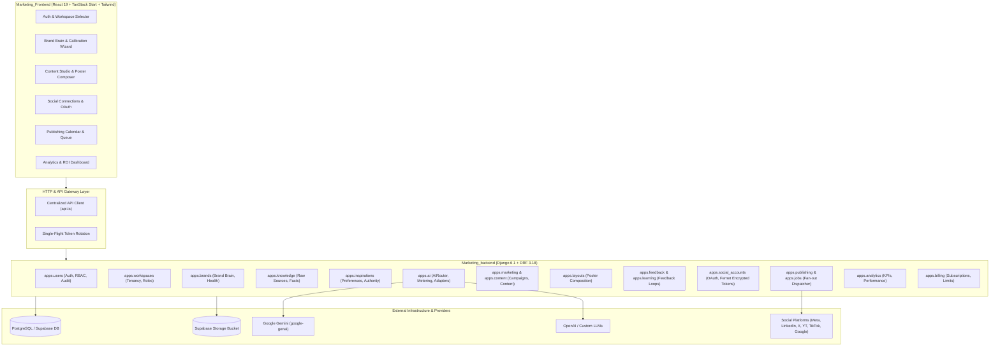
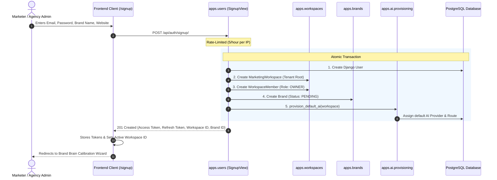
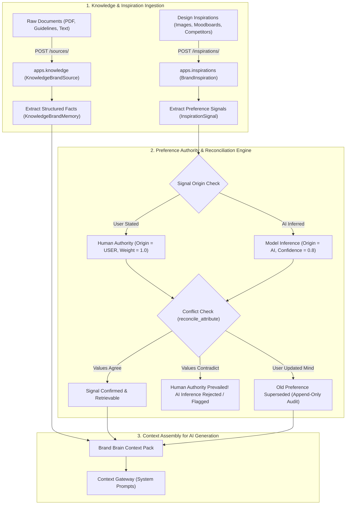
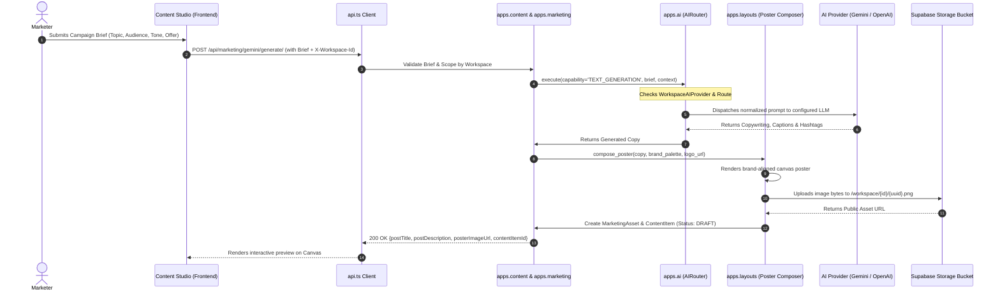
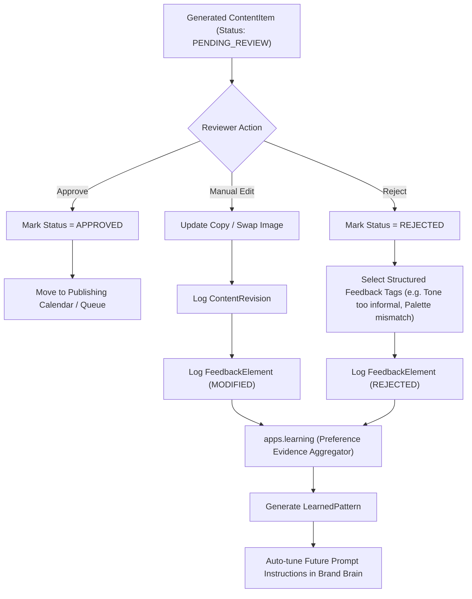
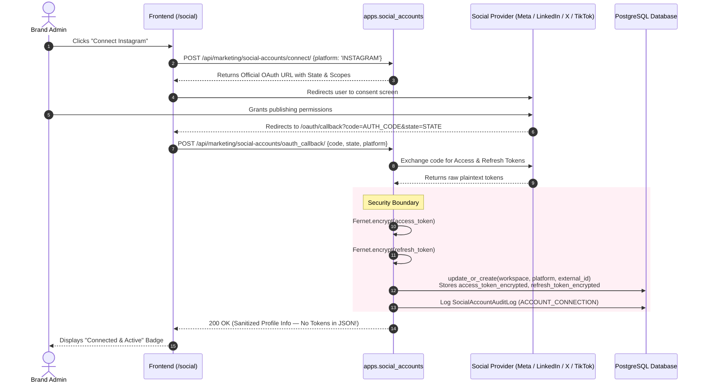
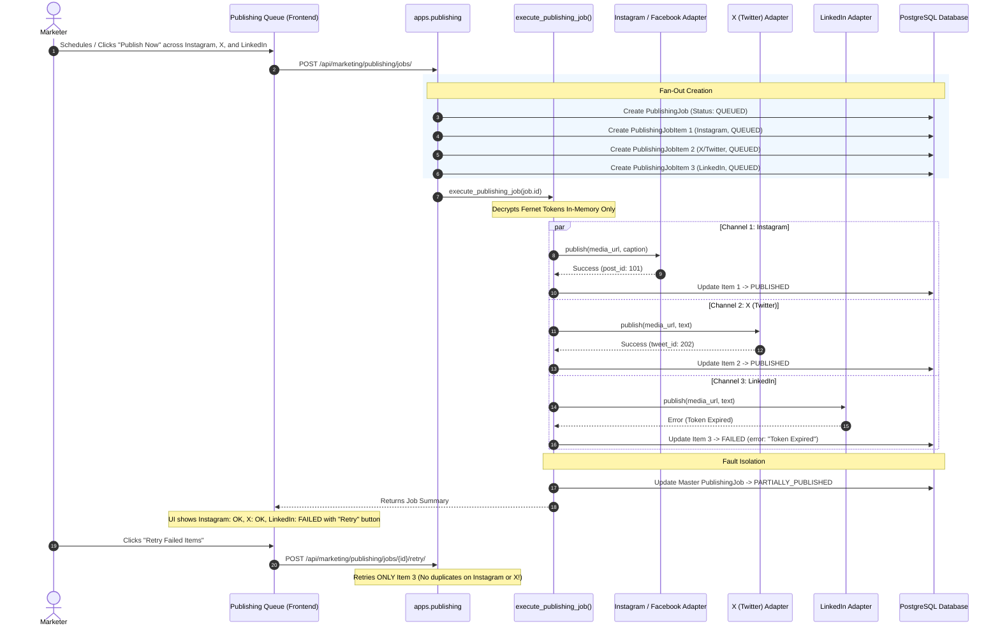
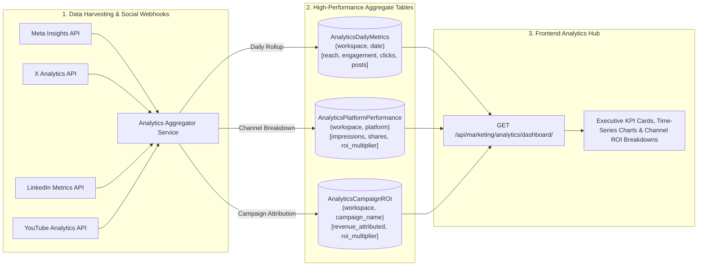

# Scaleezy Marketing Hub — Complete System Architecture & Operational Guide

## Executive Summary & Mission
**Scaleezy Marketing Hub** is an enterprise-grade, multi-tenant AI marketing and automated omnichannel social publishing platform. It empowers marketing agencies, brand managers, and enterprises to:
1. Ingest, store, and calibrate a **Brand Brain** (brand identity, voice, fonts, palette, structured memories, and design inspirations).
2. Generate hyper-personalized, multi-format marketing campaigns and brand-compliant posters using an intelligent, provider-neutral **AI Router** (Gemini, OpenAI, Custom LLM endpoints).
3. Enforce **Human-in-the-Loop Content Review & Feedback Learning Loops** to continually refine AI generation precision.
4. Seamlessly connect to major social platforms (**Meta/Instagram/Facebook, LinkedIn, X/Twitter, YouTube, TikTok, Google Business**) via encrypted OAuth.
5. Publish and schedule multi-channel campaigns with durable fan-out, per-channel failure isolation, and atomic retries.
6. Aggregate multi-platform engagement analytics, ROI metrics, and audit trails under strict **tenant isolation** and **RBAC**.

---

## 1. High-Level System Architecture



---

## 2. Visual Workflow Diagrams for Core Pillars

### Flow 1: Tenant Signup, Workspace Creation & Brand Bootstrap



---

### Flow 2: Brand Brain Ingestion & Preference Authority Engine



---

### Flow 3: Provider-Neutral AI Content Generation & Poster Composition



---

### Flow 4: Human-in-the-Loop Review Gate & Closed-Loop Reinforcement



---

### Flow 5: Social OAuth Handshake & Military-Grade Fernet Token Encryption



---

### Flow 6: Omnichannel Publishing Pipeline & Fault-Isolated Fan-Out



---

### Flow 7: Multi-Platform Analytics Aggregation & ROI Engine



---

## 3. Deep-Dive Backend Directory & App Breakdown

| Django App (`apps/`) | Business Purpose | Key Models | Key Endpoints / Services |
|---|---|---|---|
| **`users`** | Authentication, JWT management, signup rate throttling, audit logging. | `User`, `AuthAuditLog`, `SignupWebsiteClaim` | `/api/auth/signup/`, `/api/auth/login/`, `/api/auth/refresh/`, `/api/auth/me/` |
| **`workspaces`** | Multi-tenant isolation root, workspace memberships, client codes, roles (`OWNER`, `ADMIN`, `MEMBER`, `VIEWER`). | `MarketingWorkspace`, `WorkspaceMember` | `/api/marketing/workspaces/`, `/api/marketing/workspaces/switch/` |
| **`brands`** | Brand identity, colors, fonts, tone guidelines, brand health scoring. | `Brand`, `BrandBusinessProfile` | `/api/marketing/brands/`, `/api/marketing/brands/{id}/health/` |
| **`onboarding`** | Brand onboarding steps, setup wizard, brand calibration. | `OnboardingState`, `CalibrationRecord` | `/api/marketing/onboarding/` |
| **`knowledge`** | Ingestion of raw brand documents, guidelines, URLs, and extraction of structured brand memories. | `KnowledgeBrandSource`, `KnowledgeBrandMemory` | `/api/marketing/knowledge/sources/`, `/api/marketing/knowledge/memories/` |
| **`inspirations`** | Visual references, competitor moodboards, design signals, and preference authority engine. | `BrandInspiration`, `InspirationSignal` | `/api/marketing/inspirations/`, `/api/marketing/inspirations/signals/` |
| **`ai`** | Provider-neutral AI routing, custom LLM registration, capability mapping, usage and spend metering. | `AIProvider`, `WorkspaceAIProvider`, `WorkspaceAIRoute`, `AIUsageLog` | `AIRouter.execute()`, `/api/marketing/ai/providers/`, `/api/marketing/ai/routes/` |
| **`gemini`** | Gemini-specific orchestration, image analysis, caption generation, multimodal prompts. | `GeminiGenerationRequest`, `GeminiGenerationResult` | `/api/marketing/gemini/generate/`, `/api/marketing/gemini/analyze-image/` |
| **`marketing`** | Marketing assets metadata, image/video uploads, campaign configurations. | `MarketingAsset`, `Campaign` | `/api/marketing/assets/upload/`, `/api/marketing/campaigns/` |
| **`layouts`** | Programmatic canvas poster composition respecting brand kit tokens (colors, typography, logo placement). | *(Service layer & layout engines)* | `PosterCompositionService`, `/api/marketing/layouts/compose/` |
| **`content`** | Draft content items, revisions, multi-channel copy variations, review gate. | `ContentItem`, `ContentRevision` | `/api/marketing/content/`, `/api/marketing/content/{id}/review/` |
| **`feedback`** | Structured human-reviewer feedback on generated assets and copy. | `Feedback`, `FeedbackElement`, `FeedbackVocabulary` | `/api/marketing/feedback/` |
| **`learning`** | Learning loop models, preference evidence, learned generation patterns. | `LearnedPattern`, `PreferenceEvidence` | `/api/marketing/learning/patterns/` |
| **`social_accounts`** | Social media integrations, OAuth handshake, Fernet encryption, account settings, audit trails. | `SocialConnection`, `SocialAccountSettings`, `SocialAccountAuditLog` | `/api/marketing/social-accounts/connect/`, `/api/marketing/social-accounts/oauth_callback/` |
| **`publishing`** | Omnichannel publishing jobs, fan-out dispatcher, scheduling, retry engine. | `PublishingJob`, `PublishingJobItem` | `/api/marketing/publishing/jobs/`, `/api/marketing/publishing/jobs/{id}/retry/` |
| **`jobs`** | Durable background task execution infrastructure. | `TaskRun` | `/api/marketing/jobs/` |
| **`analytics`** | Aggregated daily KPIs, channel performance, ROI tracking. | `AnalyticsDailyMetrics`, `AnalyticsPlatformPerformance`, `AnalyticsCampaignROI` | `/api/marketing/analytics/dashboard/`, `/api/marketing/analytics/kpis/` |
| **`billing`** | SaaS subscription plans, capability quotas, soft & hard spend limits. | `Plan`, `Subscription`, `CapabilityLimit` | `/api/marketing/billing/subscription/` |
| **`audit`** | Comprehensive security and administrative audit logging. | `AuditLog` | `/api/marketing/audit/` |
| **`universal`** | Universal cross-tenant inspiration repository and platform-wide benchmark patterns. | `PlatformInspiration`, `UniversalPattern` | `/api/marketing/universal/inspirations/` |
| **`common`** | Shared utilities: standard response envelopes (`APIResponse`), `WorkspaceQuerySetMixin`, permission classes (`IsWorkspaceAdmin`, etc.). | *(No DB models)* | Standard envelope: `{success, data, message, error}` |

---

## 4. Frontend Architecture & UI Modules

The frontend is built with **React 19**, **TanStack Start/Router**, **Tailwind CSS**, and **Lucide Icons**:

### Key UI Modules
1. **Authentication & Session Manager (`/login`, `/signup`, `/oauth/callback`)**:
   - Intercepts requests via `api.ts`, automatically attaches `Bearer <token>` and `X-Workspace-Id`.
   - Single-flight transparent JWT token refreshing on 401 without user disruption.
2. **Dashboard Overview (`/`)**:
   - Real-time KPIs (Total Reach, Engagement Rate, Active Campaigns, Published Posts).
   - Quick Actions (Create Campaign, Connect Channel, Ingest Brand Assets).
3. **Brand Brain Studio (`/brand-brain`)**:
   - Brand Kit Editor (Logo, Hex colors, Font pairings).
   - Knowledge Base Uploader (Upload company docs, FAQs, voice guidelines).
   - Inspiration Moodboards (Visual card gallery with liked/disliked signal tags).
4. **Campaign & Content Generator (`/create`, `/content-studio`)**:
   - Step-by-step Campaign Wizard (Target audience, Tone, Product, Occasion, Offer).
   - Multimodal generation (Copywriting variants + dynamic brand-aligned poster generator).
   - Interactive Poster Canvas preview.
5. **Content Review & Approval Queue (`/review`)**:
   - Visual approval workflow with inline feedback buttons (Thumbs up/down, tone adjustments).
6. **Publishing Calendar & Channel Manager (`/publishing`, `/social`)**:
   - Multi-account connection cards with status indicators (Connected, Token Expired, Needs Re-auth).
   - Interactive scheduling calendar and publishing history queue with status pills (`PUBLISHED`, `FAILED`, `SCHEDULED`).
7. **Analytics Hub (`/analytics`)**:
   - Channel breakdown (Instagram vs LinkedIn vs X vs YouTube).
   - ROI and conversion attribution graphs.

---

## 5. Security, Tenancy & Correctness Guarantees

| Security Pillar | How Scaleezy Implements It |
|---|---|
| **Multi-Tenant Data Isolation** | Every DB query is scoped by `MarketingWorkspace`. Cross-workspace access attempts are rejected at the ORM mixin level and serializer level. |
| **Secret Encryption at Rest** | Social OAuth access/refresh tokens and custom AI provider API keys are encrypted using **Fernet (AES-128-CBC + HMAC-SHA256)**. Secrets are never exposed to the frontend. |
| **Idempotent Social Connections** | Connections are constrained by `UNIQUE(workspace, platform, external_account_id)`, ensuring re-authentications update existing records without creating orphaned rows. |
| **Per-Channel Fault Isolation** | Publishing jobs fan out into distinct `PublishingJobItem` rows. A failure on one social network does not abort or contaminate other target platforms. |
| **Append-Only Preference Authority** | Design and brand preferences in `apps.inspirations` utilize immutable signal histories and conflict-reconciliation algorithms to prevent contradicting AI behaviors. |
| **Zero Fake Completions** | System states accurately reflect real processing. Unimplemented or failing upstream tasks return explicit status codes (`501` or `FAILED`) rather than spoofing success. |

---

## 6. How to Run the Project Locally

### 1. Backend Setup
```powershell
cd Marketing_backend
# 1. Activate Python 3.12 Virtual Environment
.\.venv\Scripts\Activate.ps1

# 2. Run Database Migrations
python manage.py migrate

# 3. Start Backend Server (runs on http://127.0.0.1:8000)
python manage.py runserver
```

### 2. Frontend Setup
```powershell
cd Marketing_Frontend
# 1. Ensure .env has VITE_API_URL configured:
# VITE_API_URL=http://localhost:8000

# 2. Install dependencies (if not installed)
npm install

# 3. Start Frontend Dev Server (runs on http://localhost:5173 or 8080)
npm run dev
```

---

## 7. Key Talking Points for Team Lead / CTO Presentation

1. **Enterprise-Ready Architecture**: Clean separation of concerns across 18 specialized Django domain apps, TanStack frontend, and decoupled storage/AI layers.
2. **Provider-Agnostic AI Scalability**: Not locked into a single AI vendor. The `AIRouter` dynamically dispatches tasks between Google Gemini, OpenAI, and custom internal LLMs based on capability and cost.
3. **True Human-in-the-Loop AI**: Brand Brain memories and Inspiration preference authority continuously adapt from explicit reviewer feedback.
4. **Resilient Omnichannel Dispatch**: Multi-platform publishing with atomic retries, per-item status isolation, and encrypted OAuth token lifecycle management.
5. **Rigorous Multi-Tenancy**: Built from the ground up with workspace-isolated data access, role-based permissions, and complete audit logging.
